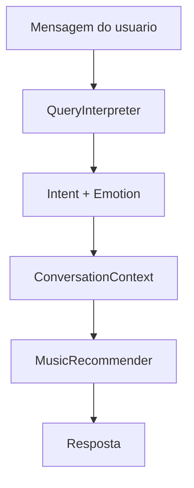
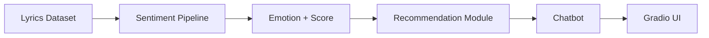

# Playcatch


Plataforma de recomendação musical baseada em análise de sentimentos das letras, interação por linguagem natural, contexto simples de conversa e feedback do usuário.

## Status

O núcleo funcional do projeto está implementado e validado; o projeto encontra-se na fase final de documentação e entrega.

```text
M0 — Project Foundation                  ✅
M1 — Análise de Sentimentos das Letras   ✅
M2 — Recomendação de Músicas             ✅
M3 — Chatbot                             ✅
M4 — Integração e Testes Finais          ✅
M5 — Encerramento / Entrega              🔄
```

## Sobre o projeto

O Playcatch é uma plataforma de recomendação musical baseada em análise de sentimentos das letras, interação por linguagem natural, contexto simples de conversa e feedback do usuário. O usuário descreve, em linguagem natural, o tipo de música que quer ouvir, e o sistema identifica o sentimento associado à consulta, recomenda músicas compatíveis a partir de um dataset previamente analisado e ajusta futuras recomendações com base no feedback do usuário.

## Funcionalidades

### Análise de sentimentos

Processamento de letras de música com classificação em quatro emoções, gerando um par `emotion` + `score` para cada faixa, com suporte aos idiomas presentes no dataset processado.

Categorias:

```text
anger
fear
joy
sadness
```

Modelo utilizado:

```text
MilaNLProc/xlm-emo-t
```

Para textos que excedem a janela de contexto do modelo, o pipeline utiliza uma estratégia de chunking:

```text
MAX_TOKENS = 480
OVERLAP_TOKENS = 64
```

Esses parâmetros refletem a configuração atual do pipeline, não uma configuração universal.

### Recomendação

O `MusicRecommender` é responsável por:

- filtrar músicas por emoção;
- ordenar por score;
- limitar a quantidade de recomendações retornadas;
- aplicar o ajuste de feedback do usuário.

Regra de feedback atual:

```text
liked
→ +0.10 no score
→ máximo 1.0

skipped
→ música excluída

sem feedback
→ score original
```

O recomendador atual é determinístico e não utiliza aprendizado de máquina adicional.

### Feedback

O usuário pode registrar dois tipos de feedback sobre uma recomendação:

```text
liked
skipped
```

Cada feedback é associado a `song_id` e `timestamp`. O armazenamento atual é em memória, durante a execução da aplicação — não há banco de dados nesta etapa.

### Chatbot



**QueryInterpreter** — transforma linguagem natural em `intent` + `emotion`:

```text
"Quero músicas felizes"      → joy
"Quero músicas melancólicas" → sadness
"Quero ouvir algo agressivo" → anger
"Quero algo assustador"      → fear
```

**ConversationContext** — mantém apenas a última emoção relevante da conversa:

```text
"Quero músicas felizes"
→ joy

"Quero mais parecidas"
→ reutiliza joy
```

O contexto não é persistente — existe apenas durante a execução em memória.

### Interface

A interface Gradio unificada está em `src/app/gradio_app.py` e disponibiliza:

- entrada de consulta;
- botão de recomendação;
- sentimento identificado;
- recomendações;
- contexto de conversa.

Executável por:

```powershell
python -m src.app.gradio_app
```

## Arquitetura

Visão geral:



## Fluxo da aplicação

```text
Usuário
↓
Gradio
↓
PlaycatchApp
↓
ChatbotRecommendationService
↓
QueryInterpreter
↓
ConversationContext
↓
MusicRecommender
↓
Resposta
```

## Estrutura do projeto

```text
playcatch/
├── data/
│   └── processed/
│       └── lyrics_sentiment.csv
├── docs/
│   ├── architecture/
│   └── model/
├── src/
│   ├── app/
│   ├── chatbot/
│   ├── preprocessing/
│   ├── recommendation/
│   └── sentiment/
├── tests/
│   ├── app/
│   ├── chatbot/
│   ├── data/
│   ├── preprocessing/
│   ├── recommendation/
│   └── sentiment/
├── .gitignore
├── requirements.txt
└── README.md
```

## Dependências

Principais dependências do projeto (`requirements.txt`):

```text
torch
transformers
gradio
datasets
huggingface_hub
pytest==9.1.1
```

`ruff` é utilizada como ferramenta de qualidade de código durante o desenvolvimento.

## Requisitos

```text
Windows
PowerShell
Python 3.12.3
.venv
```

O ambiente de desenvolvimento foi validado com suporte a GPU CUDA (NVIDIA GeForce RTX 4060), mas GPU não é um requisito obrigatório para execução do projeto. Este README não faz promessas de desempenho de produção.

## Instalação

```powershell
python -m venv .venv
.\.venv\Scripts\Activate.ps1
python -m pip install -r requirements.txt
```

## Execução

Com o ambiente virtual ativo:

```powershell
python -m src.app.gradio_app
```

A aplicação carrega o dataset final de sentimentos:

```text
data/processed/lyrics_sentiment.csv
```

Esse artefato é necessário para a execução da aplicação integrada. Caso o arquivo não esteja presente localmente, a aplicação não conseguirá carregar os dados de recomendação — não há, neste projeto, um dataset alternativo embutido.

## Exemplo de uso

```text
Usuário:
Quero músicas felizes

Playcatch:
Encontrei estas músicas para 'joy':

1. ...
2. ...
3. ...
```

```text
Usuário:
Quero mais parecidas
```

Nesse caso, o sistema reutiliza o último contexto emocional identificado na conversa (`joy`, no exemplo acima) para gerar a nova recomendação.

## Dados e licenciamento

O dataset final de sentimentos está em:

```text
data/processed/lyrics_sentiment.csv
```

com a estrutura:

```text
song_id
title
artist
language
lyrics
emotion
score
```

Resultado da Milestone 1:

```text
79 registros
7 colunas
0 valores nulos
0 scores fora de [0,1]
```

Distribuição observada das previsões do modelo:

```text
sadness = 32
joy     = 26
anger   = 19
fear    = 2
```

Esses números representam a distribuição das previsões produzidas pelo modelo de sentimento, e não uma verdade emocional objetiva (ground truth) sobre as músicas.

**Licenciamento:** o dataset contém letras de músicas. Os arquivos textuais permanecem fora do versionamento Git por precaução, enquanto o código do pipeline é normalmente versionado. A redistribuição das letras depende da análise de licenciamento por faixa, já registrada na documentação da Milestone 1. Nenhuma conclusão jurídica definitiva é feita neste README.

## Testes e validação

Estado validado na conclusão da Milestone 4 (Issue #26):

```text
pytest -q
93 passed
```

Qualidade de código:

```text
ruff check .
All checks passed!

ruff format --check .
49 files already formatted
```

Esses números correspondem ao estado validado nesse momento do projeto, e não são apresentados como garantia permanente.

**Testes de usabilidade:**

```text
4 emoções validadas
20 execuções consecutivas
20/20 concluídas
respostas consistentes
```

Tempo observado:

```text
mínimo: 0.0038s
máximo: 0.0044s
médio: 0.0039s
```

Esses tempos refletem o resultado do ambiente de validação utilizado e não constituem um benchmark universal.

## Limitações

- o modelo de sentimento (`MilaNLProc/xlm-emo-t`) não foi validado cientificamente para letras musicais;
- não existe ground truth humano para as previsões de sentimento;
- `score` não é uma medida de acurácia;
- o recomendador é determinístico e não utiliza aprendizado estatístico;
- o feedback do usuário não possui persistência em banco de dados;
- o contexto de conversa do chatbot não é persistente entre execuções;
- o interpretador de consultas (`QueryInterpreter`) é determinístico;
- a interface Gradio é funcional, porém uma primeira versão simples;
- não existe infraestrutura de produção configurada para o projeto;
- o dataset textual está sujeito a questões de licenciamento por faixa, ainda pendentes de análise completa.

## Documentação adicional

- [`docs/architecture/chatbot-architecture-decision.md`](docs/architecture/chatbot-architecture-decision.md) — decisão arquitetural do chatbot
- [`docs/architecture/system-operation-and-execution.md`](docs/architecture/system-operation-and-execution.md) — funcionamento e execução do sistema
- [`docs/model/`](docs/model/) — documentação relacionada ao modelo de sentimento

## Roadmap

```text
M0 — Foundation                  ✅
M1 — Sentimento                  ✅
M2 — Recomendação                ✅
M3 — Chatbot                     ✅
M4 — Integração                  ✅
M5 — Encerramento / Entrega      🔄
```

## Autor

Autor: Vagner Ferreira

Projeto: Playcatch