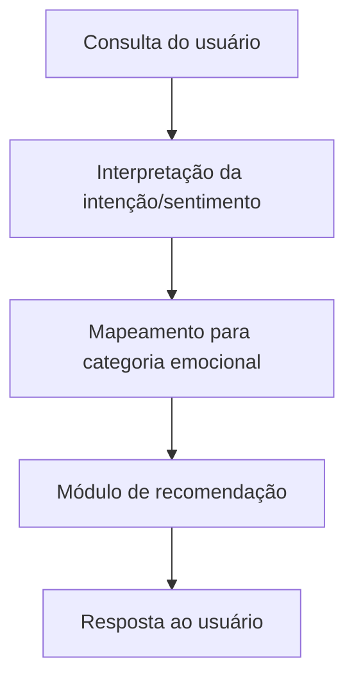

# ADR-003 — Chatbot como camada de interpretação

**Data:** 17/08/2026  
**Marco:** Milestone 0 — Project Foundation  
**Autor:** Vagner Ferreira  
**Projeto:** Playcatch  
**Status:** Decisão planejada — a ser implementada na Milestone 3

# ADR-003 — Chatbot como camada de interpretação

**Status:** Decisão planejada (a ser implementada na Milestone 3)
**Data:** Milestone 0
**Contexto do projeto:** Playcatch

## Contexto

O Playcatch precisa de uma camada que permita ao usuário fazer consultas em linguagem natural (ex.: "quero ouvir algo animado") e receber recomendações musicais compatíveis. Uma opção seria implementar um chatbot generativo completo, com modelo de linguagem conversacional complexo; outra é tratar o "chatbot" como uma camada de interpretação de intenção que aciona o recomendador já existente.

## Decisão

A primeira implementação do chatbot atuará como uma **camada de interpretação + orquestração**: a consulta do usuário é interpretada para identificar a intenção/sentimento, esse sentimento é mapeado para uma categoria emocional do Playcatch, e o módulo de recomendação (Milestone 2) é acionado com essa categoria. Um contexto simples de conversa será mantido, mas sem depender de geração conversacional complexa.

Fluxo esperado:

## Alternativas ainda abertas

- Uso de um modelo conversacional generativo mais robusto (ex.: DialoGPT ou similar) para respostas mais naturais — não descartado, mas não é a abordagem inicial.
- Manutenção de contexto mais elaborada entre múltiplas interações — a ser avaliada durante a Milestone 3, conforme testes com mensagens variadas e ambíguas.

## Consequências

- Reduz a complexidade de implementação e o risco de respostas incoerentes.
- Reutiliza diretamente o módulo de recomendação já validado na Milestone 2.
- Pode limitar a naturalidade das respostas em comparação a um chatbot generativo completo, o que é aceitável para o escopo do checkpoint.