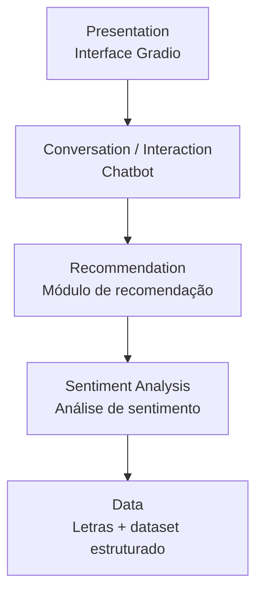
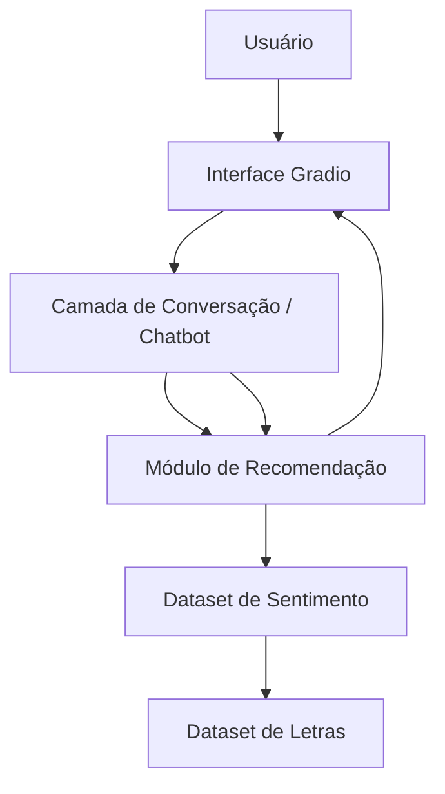
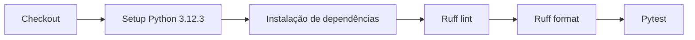

# Arquitetura — Playcatch

**Data:** 17/08/2026  
**Marco:** Milestone 0 — Project Foundation  
**Autor:** Vagner Ferreira  
**Projeto:** Playcatch  
**Status:** Arquitetura inicial / planejada

## 1. Visão geral

O Playcatch é uma aplicação de recomendação musical baseada em análise de sentimento das letras. O usuário interage com o sistema por meio de uma interface Gradio, podendo receber recomendações diretamente por sentimento ou por meio de um chatbot que interpreta consultas em linguagem natural.

Este documento descreve a arquitetura **planejada** do sistema, com base no roadmap oficial de 6 milestones do projeto. Neste momento, apenas a fundação técnica (Milestone 0) está concluída — estrutura de projeto, ambiente Python, dependências, GPU/CUDA, lint, testes e CI. Os componentes funcionais (análise de sentimento, recomendação, chatbot e integração) ainda serão implementados progressivamente nas próximas milestones, conforme indicado ao longo deste documento.

## 2. Camadas conceituais

O sistema é organizado em cinco camadas conceituais, dispostas da interface até os dados:



Cada camada corresponde a um ou mais milestones do roadmap e será detalhada nas seções seguintes.

## 3. Fluxo arquitetural planejado

O diagrama abaixo representa o fluxo de uma consulta do usuário até a recomendação final, unindo interface, chatbot, recomendador e dados de sentimento. Este fluxo é **planejado**: hoje nenhum desses componentes está implementado, apenas a fundação do projeto (Milestone 0).



## 4. Responsabilidades por componente

### 4.1 Data Layer
**Status:** planejado (Milestone 1)

Responsável por:
- armazenar as letras de músicas utilizadas como fonte de entrada;
- armazenar o dataset estruturado de sentimentos gerado pela camada de análise;
- fornecer dados para as camadas de análise de sentimento e recomendação.

### 4.2 Sentiment Analysis
**Status:** planejado (Milestone 1)

Responsável por:
- receber as letras normalizadas;
- executar um modelo de sentimento sobre o texto;
- mapear a saída do modelo para categorias emocionais definidas pelo Playcatch;
- registrar o score/confiança da previsão junto ao resultado.

Entregável previsto: dataset estruturado (CSV/JSON) de sentimentos.

### 4.3 Recommendation
**Status:** planejado (Milestone 2)

Responsável por:
- receber o sentimento ou preferência informada;
- filtrar músicas compatíveis a partir do dataset de sentimentos;
- aplicar regras simples de feedback (`gostei` / `pulei`) para ajustar recomendações futuras;
- retornar a lista de recomendações.

Entregável previsto: módulo de recomendação testado e reutilizável.

### 4.4 Conversation / Chatbot
**Status:** planejado (Milestone 3)

Responsável por:
- interpretar a consulta do usuário em linguagem natural;
- identificar sentimento/preferência a partir da consulta;
- acionar o módulo de recomendação com a categoria emocional identificada;
- manter um contexto simples de conversa.

A abordagem prevista é uma **camada de interpretação + orquestração**, e não um chatbot generativo complexo (ver ADR-003).

### 4.5 Presentation / Gradio
**Status:** planejado (Milestone 3–4)

Responsável por:
- prover a interface do usuário;
- capturar mensagens/entradas do usuário;
- apresentar as recomendações retornadas;
- mediar a interação com o chatbot.

### 4.6 CI / Quality
**Status:** implementado (Milestone 0)

Responsável por:
- lint (Ruff);
- formatação (Ruff format);
- testes automatizados (Pytest);
- validação automática via GitHub Actions a cada push/PR.

Pipeline atual do CI:



## 5. Estado atual da estrutura de diretórios

```text
playcatch/
├── .github/
│   └── workflows/
│       └── ci.yml
├── data/
│   └── .gitkeep
├── docs/
├── src/
│   └── .gitkeep
├── tests/
│   ├── .gitkeep
│   └── test_smoke.py
├── .gitignore
├── README.md
├── pyproject.toml
└── requirements.txt
```

A pasta `src/` ainda está vazia (apenas `.gitkeep`): a implementação dos módulos de sentimento, recomendação e chatbot ocorrerá nas próximas milestones, dentro desta estrutura.

## 6. Ambiente e dependências (estado atual)

- Python 3.12.3
- PyTorch 2.12.0 com CUDA 13.2, validado em GPU NVIDIA RTX 4060
- Transformers, Gradio, Datasets, Hugging Face Hub como dependências principais
- Ruff para lint/formatação, Pytest para testes
- GitHub Actions como pipeline de CI, já validado em execução bem-sucedida

## 7. Rastreabilidade com o roadmap

| Camada | Milestone | Status |
|---|---|---|
| CI / Quality | M0 — Project Foundation | ✅ Concluído |
| Data + Sentiment Analysis | M1 — Análise de Sentimentos | 🔜 Planejado |
| Recommendation | M2 — Recomendação de Músicas | 🔜 Planejado |
| Conversation / Chatbot | M3 — Chatbot | 🔜 Planejado |
| Integração de todas as camadas | M4 — Integração e Testes Finais | 🔜 Planejado |
| Publicação/documentação final | M5 — Encerramento / Entrega | 🔜 Planejado |

## 8. Decisões técnicas

As decisões técnicas relacionadas a esta arquitetura estão registradas separadamente em `docs/adr/`, cada uma indicando se é uma decisão já tomada, planejada ou uma alternativa ainda aberta:

- [ADR-001 — Arquitetura incremental](../adr/ADR-001-incremental-architecture.md)
- [ADR-002 — Recomendação baseada em sentimento](../adr/ADR-002-sentiment-based-recommendation.md)
- [ADR-003 — Chatbot como camada de interpretação](../adr/ADR-003-chatbot-interpretation-layer.md)
- [ADR-004 — GPU/CUDA local](../adr/ADR-004-local-gpu-cuda.md)
- [ADR-005 — Qualidade automatizada](../adr/ADR-005-automated-quality.md)

## Checklist da Issue #6

- [x] Visão arquitetural documentada
- [x] Responsabilidades dos componentes documentadas
- [x] Decisões técnicas registradas
- [x] Documentação organizada em docs/
- [x] Arquitetura alinhada ao roadmap