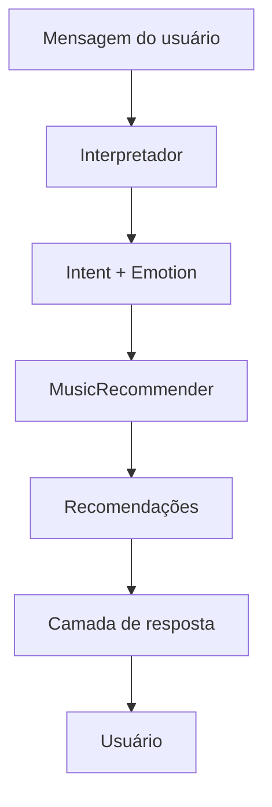
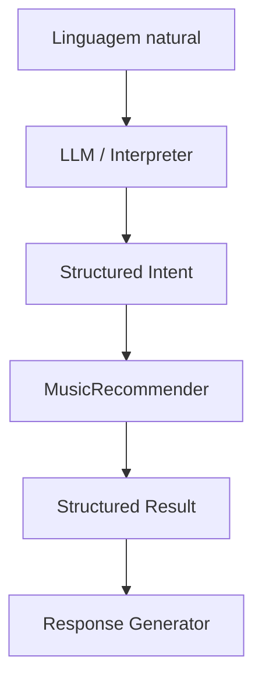

# Decisão Arquitetural do Chatbot — Playcatch

**Data:** 17/08/2026
**Marco:** Milestone 3 — Chatbot
**Autor:** Vagner Ferreira
**Projeto:** Playcatch
**Status:** Decisão técnica inicial

---

## 1. Objetivo

Avaliar as alternativas de arquitetura para o chatbot do Playcatch e definir a abordagem técnica que orientará as próximas Issues da Milestone 3, sem antecipar detalhes de implementação (biblioteca, prompts, modelo específico, interface). O critério de conclusão desta Issue é a escolha e o registro da decisão arquitetural, não a construção do chatbot.

## 2. Contexto

A Milestone 2 já entrega um módulo de recomendação testado e reutilizável:

```text
Dataset de sentimentos
        ↓
emotion + score
        ↓
MusicRecommender
        ↓
liked / skipped
        ↓
ajuste determinístico de score
```

O `MusicRecommender` aceita uma emoção dentre `anger`, `fear`, `joy`, `sadness` e retorna músicas compatíveis. O feedback do usuário já está implementado com regras simples e determinísticas: `liked` incrementa o score em 0,10 (limitado a 1,0), `skipped` exclui a música, e a ausência de feedback mantém o score original. Não há ML de recomendação nesta etapa — a lógica é determinística.

O chatbot da Milestone 3 precisa se conectar a este componente já existente, sem duplicar sua lógica.

## 3. Requisitos

**Entrada:** mensagens em linguagem natural, como:

```text
"Quero músicas felizes"
"Estou triste, me recomenda alguma coisa"
"Quero ouvir algo mais agressivo"
"Estou para baixo, me sugira algumas músicas"
```

**Saída intermediária esperada:** uma estrutura próxima de:

```text
intent = "recommend"
emotion = "joy"
```

ou

```text
intent = "recommend"
emotion = "sadness"
```

**Saída final:** produzida pelo sistema de recomendação já existente (`MusicRecommender`). O chatbot não deve duplicar a lógica de recomendação — apenas traduzir a intenção do usuário para os termos que o recomendador já entende.

## 4. Alternativa A — Modelo gerador

Fluxo conceitual:

```text
Usuário
   ↓
LLM
   ↓
interpretação + resposta + recomendação
```

Nesta alternativa, um modelo gerador (local ou via API) interpretaria a mensagem do usuário e, potencialmente, também decidiria ou influenciaria diretamente a recomendação e a resposta final.

**Avaliação:**

- **Complexidade:** alta — exige integração com um LLM, definição de prompts, tratamento de saídas não estruturadas e, possivelmente, parsing adicional para extrair intenção de forma confiável.
- **Dependência externa:** alta caso se opte por um modelo via API; mesmo com modelo local, aumenta a superfície de dependências do projeto.
- **Custo:** variável — sem custo relevante para modelo local pequeno, mas com custo recorrente caso se use uma API externa; não há necessidade de comprometer o projeto com esse custo no escopo atual.
- **Latência:** tende a ser maior do que uma camada de regras/interpretação leve, especialmente com modelos maiores ou chamadas de API.
- **Controle:** baixo — a lógica de decisão fica parcialmente dentro do modelo, dificultando prever e auditar o comportamento.
- **Testabilidade:** baixa a média — saídas de um LLM são menos determinísticas, tornando testes automatizados mais frágeis ou exigindo mocks/validações adicionais.
- **Determinismo:** baixo — para a mesma entrada, um modelo gerador pode produzir variações na resposta.
- **Adequação ao Playcatch:** o conjunto de emoções do projeto é pequeno e fechado (4 categorias), o que reduz a necessidade de um modelo gerador completo apenas para essa classificação.

## 5. Alternativa B — Interpretação + orquestração

Fluxo conceitual:

```text
Usuário
   ↓
Interpretador
   ↓
Intent + Emotion
   ↓
MusicRecommender
   ↓
Resultado
   ↓
Gerador de resposta
```

A ideia central é separar claramente:

```text
interpretação da linguagem
≠
lógica de recomendação
≠
geração da resposta
```

**Avaliação:**

- **Simplicidade:** maior — a interpretação se resume a mapear a mensagem para uma estrutura fechada (`intent` + `emotion`), compatível com o conjunto de categorias já existente.
- **Controle:** alto — cada etapa do fluxo é isolada e auditável.
- **Testabilidade:** alta — a interpretação pode ser testada com casos de entrada conhecidos e saídas esperadas, sem depender de geração não determinística.
- **Baixo custo:** sim — não exige, necessariamente, API paga nem modelo gerador pesado.
- **Facilidade de integração:** alta — conecta-se diretamente ao `MusicRecommender` já existente, sem necessidade de adaptação da lógica de recomendação.
- **Determinismo:** alto — para a mesma entrada normalizada, o comportamento tende a ser mais previsível.
- **Manutenção:** mais simples — a lógica de negócio permanece concentrada no `MusicRecommender`, e o chatbot apenas orquestra.
- **Risco de alucinação na lógica de negócio:** muito reduzido, pois a decisão de quais músicas recomendar permanece no `MusicRecommender` e não depende de geração livre de conteúdo. Ainda assim, caso uma camada geradora seja usada futuramente na resposta (Seção 10), ela produzirá apenas texto, sem controlar quais músicas são recomendadas.
- **Extensibilidade:** permite, futuramente, substituir o interpretador por um LLM sem alterar o `MusicRecommender`.

## 6. Comparação

| Critério | Modelo gerador | Interpretação + orquestração |
|---|---|---|
| Complexidade | Alta | Baixa |
| Custo | Médio a alto | Baixo |
| Latência | Média a alta | Baixa |
| Determinismo | Baixo | Alto |
| Testabilidade | Baixa a média | Alta |
| Controle | Baixo | Alto |
| Manutenção | Mais complexa | Mais simples |
| Integração com recomendador | Exige cuidado adicional para não duplicar lógica | Direta |
| Risco de alucinação na lógica de negócio | Presente | Muito reduzido |
| Adequação ao Playcatch | Baixa para o escopo atual | Alta para o escopo atual |

## 7. Decisão

**Decisão:** adotar a **Alternativa B — Interpretação + orquestração** como arquitetura principal do chatbot, mantendo qualquer modelo gerador como componente **opcional e futuro** de interface (interpretador ou camada de resposta), sem substituir a lógica de recomendação existente.

Esta direção foi avaliada criticamente e considerada **mais adequada ao escopo atual** do Playcatch, pelas seguintes razões:

- o conjunto de emoções do projeto é pequeno e fechado (`anger`, `fear`, `joy`, `sadness`), o que torna uma camada de interpretação simples suficiente para atender aos requisitos de entrada descritos na Seção 3;
- a lógica de recomendação já existe e está testada (`MusicRecommender`), e a Alternativa B **reduz o acoplamento** entre interpretação de linguagem e lógica de negócio;
- o projeto é de escopo reduzido (checkpoint/portfólio), o que torna a Alternativa B **mais simples para os requisitos atuais**, com menor custo e latência;
- separar interpretação, recomendação e geração de resposta **oferece maior controle dentro deste projeto**, facilitando testes e manutenção;
- a arquitetura escolhida não impede a introdução futura de um LLM — apenas posiciona esse LLM como um possível interpretador substituível, e não como responsável pela decisão de quais músicas recomendar.

Esta escolha reflete a adequação da Alternativa B ao contexto específico do Playcatch nesta fase, e não uma afirmação de que essa arquitetura é superior em qualquer contexto ou de que um modelo gerador seria inadequado em outros projetos ou em fases futuras deste mesmo projeto.

## 8. Arquitetura escolhida



## 9. Responsabilidades dos componentes

### Interpretador

Transforma linguagem natural em uma estrutura interna fechada (`intent` + `emotion`). Exemplo conceitual:

```text
"Estou triste, quero músicas"

→

intent = recommend
emotion = sadness
```

### MusicRecommender

Permanece responsável, como já implementado na Milestone 2, por:

- filtrar músicas por emoção;
- aplicar o ajuste de feedback (`liked`/`skipped`);
- ordenar os resultados;
- limitar a quantidade de recomendações retornadas.

### Camada de resposta

Transforma o resultado estruturado retornado pelo `MusicRecommender` em texto amigável para o usuário.

**Princípio arquitetural registrado:**

```text
Interpretação da linguagem
        ≠
Lógica de recomendação
        ≠
Geração da resposta
```

O chatbot não deve possuir lógica própria de recomendação, nem duplicar regras de filtro, ranking, score ou feedback já implementadas pelo `MusicRecommender`. Ele funciona como uma camada de interpretação e orquestração em torno do módulo de recomendação já existente:

```text
Chatbot
   ↓
Intent + Emotion
   ↓
MusicRecommender
```

## 10. Extensibilidade futura

A arquitetura escolhida permite, futuramente, introduzir um modelo gerador como interpretador (ou como camada de resposta), sem que o LLM se torne responsável pela lógica de negócio:



Isso é registrado como **extensibilidade futura**, não como requisito da Issue #18 nem de nenhuma issue subsequente definida até o momento.

## 11. Impacto nas próximas Issues

```text
#18 — Decisão arquitetural ✅ (esta Issue)
#19 — Entendimento de consulta → sentimento
#20 — Conectar chatbot ao recomendador
#21 — Contexto simples de conversa
#22 — Interface Gradio
#23 — Testes com mensagens variadas e ambíguas
```

O fluxo arquitetural estabelecido nesta Issue deve ser seguido pelas próximas:

```text
Mensagem
   ↓
Intent + Emotion
   ↓
MusicRecommender
   ↓
Resultado estruturado
   ↓
Resposta
```

A Issue #18 **não escolhe ainda** a técnica concreta de interpretação — não define se será baseada em regras, palavras-chave, classificador leve, embeddings, LLM ou qualquer biblioteca específica. Essa escolha pertence à Issue #19.

A Issue #20 deverá conectar o interpretador ao `MusicRecommender`, respeitando o contrato arquitetural definido aqui — mas esta documentação não inclui código de integração, não define interfaces concretas nem classes adicionais; isso é escopo da própria Issue #20.

## 12. Limitações

- Nenhuma técnica concreta de interpretação foi escolhida nesta Issue.
- Nenhum benchmark numérico de custo ou latência foi realizado — a comparação da Seção 6 é qualitativa.
- Mensagens ambíguas reais ainda não foram testadas contra essa arquitetura — isso é tratado na Issue #23.
- A qualidade da experiência do usuário com a interpretação escolhida ainda não foi validada.
- O uso futuro de um LLM permanece possível, conforme a extensibilidade descrita na Seção 10, mas não é implementado ou detalhado nesta Issue.

## Checklist da Issue #18

- [x] Alternativas avaliadas
- [x] Modelo gerador analisado
- [x] Interpretação + orquestração analisada
- [x] Requisitos considerados
- [x] Complexidade avaliada
- [x] Testabilidade avaliada
- [x] Arquitetura escolhida
- [x] Responsabilidades dos componentes definidas
- [x] Extensibilidade futura registrada