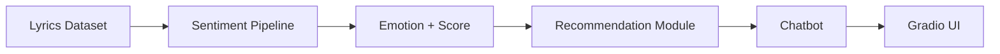
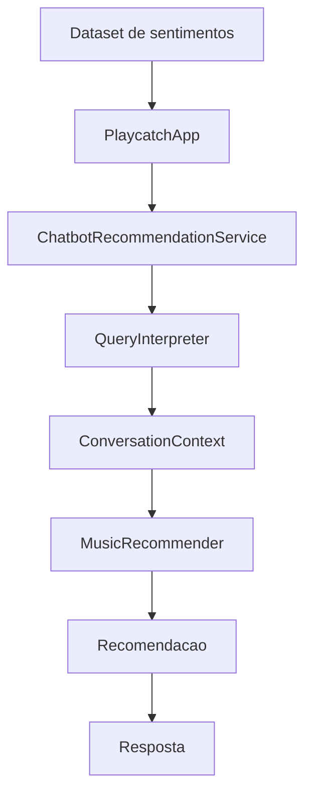
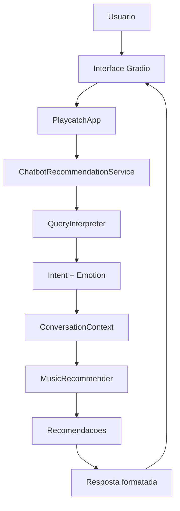

# Funcionamento e Execução do Playcatch

**Data:** 17/08/2026
**Marco:** Milestone 4 — Integração e Testes Finais
**Autor:** Vagner Ferreira
**Projeto:** Playcatch
**Status:** Documentação técnica da aplicação integrada

---

## 1. Objetivo

Consolidar, em um único documento, o funcionamento real e validado do Playcatch após a integração dos componentes construídos nas Milestones 1 a 4, e descrever como reproduzir a aplicação localmente. Este documento reflete apenas o estado efetivamente implementado e validado no projeto até a Issue #27 — nenhum componente, dependência ou funcionalidade idealizada é descrita aqui.

## 2. Visão geral

O Playcatch foi construído incrementalmente ao longo de quatro milestones:

```text
M0 — Project Foundation
M1 — Análise de Sentimentos das Letras
M2 — Recomendação de Músicas
M3 — Chatbot
M4 — Integração e Testes Finais
```

O resultado é uma aplicação que recebe uma consulta em linguagem natural, identifica um sentimento associado, recomenda músicas compatíveis com esse sentimento e apresenta o resultado ao usuário através de uma interface Gradio.

## 3. Arquitetura

Visão simplificada do fluxo lógico geral do sistema:



Esta visão representa o fluxo lógico geral de construção do sistema, da fonte de dados até a interface. Em execução, a aplicação parte diretamente do dataset já processado pela Milestone 1 (`data/processed/lyrics_sentiment.csv`) — o pipeline de sentimento não é reexecutado a cada consulta do usuário.

## 4. Componentes principais

### 4.1 Milestone 1 — Análise de sentimentos (estado consolidado)

O pipeline de sentimentos foi concluído sobre **79 letras**, gerando o dataset:

```text
data/processed/lyrics_sentiment.csv
```

Estrutura:

```text
song_id
title
artist
language
lyrics
emotion
score
```

Resultado validado:

```text
79 registros
7 colunas
0 valores nulos
0 scores fora de [0,1]
```

Emoções: `anger`, `fear`, `joy`, `sadness`.

Modelo utilizado: `MilaNLProc/xlm-emo-t`. Para letras longas, o pipeline utiliza chunking:

```text
MAX_TOKENS = 480
OVERLAP_TOKENS = 64
```

### 4.2 Módulo de recomendação

Localizado em:

```text
src/recommendation/
```

Componentes:

```text
sentiment_data_loader.py
recommender.py
feedback.py
profile_simulation.py
```

- **`SentimentDataLoader`**: carrega e valida o dataset produzido pela Milestone 1.
- **`MusicRecommender`**: filtra músicas por emoção, ordena por score, limita a quantidade de resultados e aplica o feedback do usuário. Regra de feedback:

```text
liked
    → +0.10 no score
    → máximo 1.0

skipped
    → música excluída

sem feedback
    → score original
```

- **`FeedbackTracker`**: registra `song_id`, `feedback` e `timestamp` para cada interação. Feedbacks válidos: `liked`, `skipped`.
- **`profile_simulation.py`**: executa perfis simulados para validar a adaptação do recomendador ao feedback.

### 4.3 Chatbot

Localizado em:

```text
src/chatbot/
```

Componentes:

```text
query_interpreter.py
conversation_context.py
recommendation_service.py
gradio_app.py
chatbot_validation.py
```

- **`QueryInterpreter`**: transforma linguagem natural em `intent` + `emotion`, suportando as quatro emoções do sistema (`joy`, `sadness`, `anger`, `fear`). Exemplos:

```text
"Quero músicas felizes"    → joy
"Quero músicas melancólicas" → sadness
"Quero algo agressivo"     → anger
"Quero algo assustador"    → fear
```

O interpretador trata variações linguísticas, acentuação, maiúsculas/minúsculas, e lida com consultas não reconhecidas ou ambíguas.

- **`ConversationContext`**: mantém apenas o último sentimento relevante da conversa. Exemplo:

```text
"Quero músicas felizes"
        ↓
context = joy

"Quero mais parecidas"
        ↓
usa joy
```

Não há memória persistente ou banco de dados nesta etapa — o contexto existe apenas durante a execução em memória.

- **`recommendation_service.py`**: orquestra o fluxo entre interpretação, contexto e recomendação:

```text
Mensagem
   ↓
QueryInterpreter
   ↓
Intent + Emotion
   ↓
ConversationContext
   ↓
MusicRecommender
   ↓
Resposta formatada
```

O chatbot não duplica a lógica do recomendador — toda decisão sobre quais músicas retornar permanece no `MusicRecommender`.

### 4.4 Aplicação integrada

O componente principal de integração é:

```text
src/app/playcatch_app.py
```

Responsabilidades do `PlaycatchApp`:

- carregar o dataset de sentimentos;
- criar o `ChatbotRecommendationService`;
- fornecer uma API simples para processar consultas;
- manter o fluxo integrado entre os componentes.

Fluxo:



A aplicação pode ser inicializada a partir do CSV processado através de `PlaycatchApp.from_csv()`.

### 4.5 Interface Gradio

Localizada em:

```text
src/app/gradio_app.py
```

Reúne, em uma única experiência construída com `gr.Blocks`:

- campo de consulta;
- botão de recomendação;
- sentimento identificado;
- área de resposta;
- contexto simples da conversa;
- recomendações retornadas.

## 5. Fluxo ponta a ponta



Resumo de cada etapa: o usuário digita uma consulta na interface Gradio; a `PlaycatchApp` encaminha a mensagem ao `ChatbotRecommendationService`; o `QueryInterpreter` extrai `intent` e `emotion` da mensagem; o `ConversationContext` combina esse resultado com o sentimento relevante mais recente da conversa, quando aplicável; o `MusicRecommender` filtra e ordena as músicas compatíveis, aplicando eventuais ajustes de feedback já registrados; o resultado é formatado em uma resposta e devolvido à interface Gradio, que o exibe ao usuário.

## 6. Estrutura do projeto

```text
playcatch/
├── data/
│   └── processed/
│       └── lyrics_sentiment.csv
├── docs/
│   ├── architecture/
│   └── model/
├── src/
│   ├── app/
│   ├── chatbot/
│   ├── preprocessing/
│   ├── recommendation/
│   └── sentiment/
└── tests/
    ├── app/
    ├── chatbot/
    ├── data/
    ├── preprocessing/
    ├── recommendation/
    └── sentiment/
```

## 7. Dependências

Dependências efetivamente envolvidas na implementação atual:

```text
Python 3.12.x
pandas
transformers
torch
gradio
pytest
ruff
```

O modelo `MilaNLProc/xlm-emo-t` não é uma dependência de pacote Python — ele é obtido através do ecossistema Hugging Face no momento em que o pipeline de sentimento é carregado (via `transformers`).

Versões específicas de cada pacote não são reafirmadas aqui além do que já está fixado em `requirements.txt`, para evitar divergência entre esta documentação e o arquivo real de dependências do projeto.

## 8. Configuração do ambiente

Ambiente de desenvolvimento utilizado:

```text
Windows
PowerShell
Python 3.12.3
.venv
```

O projeto possui ambiente CUDA funcional e foi validado em GPU NVIDIA GeForce RTX 4060. A execução em CPU é uma alternativa conceitualmente possível para rodar o sistema, mas não há, nesta documentação, afirmação de desempenho equivalente entre CPU e GPU — os tempos registrados na Seção 12 correspondem ao ambiente validado (GPU).

## 9. Instalação

```powershell
python -m venv .venv
.\.venv\Scripts\Activate.ps1
python -m pip install -r requirements.txt
```

Este processo instala o ambiente completo definido em `requirements.txt`.

## 10. Execução

A interface Gradio é iniciada através de:

```powershell
python -m src.app.gradio_app
```

Ao ser iniciada, a interface carrega o dataset processado:

```text
data/processed/lyrics_sentiment.csv
```

através do `PlaycatchApp`. Este CSV é um artefato local: como contém letras de músicas, ele está sujeito às questões de licenciamento por faixa já registradas na documentação da Milestone 1, e por isso permanece fora do versionamento Git — não há, nesta documentação, exigência ou recomendação de que esse arquivo seja publicado no repositório.

## 11. Testes

O projeto atualmente possui **93 testes passando**, estado validado após a conclusão da Issue #26:

```text
pytest -q

93 passed
```

Qualidade de código:

```text
ruff check .
→ All checks passed!

ruff format --check .
→ 49 files already formatted
```

Esses números correspondem ao estado do projeto no momento das Issues #26/#27 e não são apresentados como garantia permanente — tendem a mudar à medida que o projeto evolui.

## 12. Validação de usabilidade

Na Issue #26 foram validadas as quatro emoções suportadas pelo sistema: `joy`, `sadness`, `anger`, `fear`.

Estabilidade observada:

```text
20 execuções
20/20 concluídas
respostas consistentes
```

Tempo observado:

```text
mínimo: 0.0038s
máximo: 0.0044s
médio: 0.0039s
```

Esses valores representam o **tempo observado no ambiente de validação** (Issue #26), e não constituem um benchmark universal nem um SLA. Não há garantia de que o sistema sempre responderá dentro desses tempos em outros ambientes ou condições de carga.

## 13. Dados e licenciamento

- o dataset textual (letras de músicas) deve ser tratado com cuidado quanto à sua origem e licenciamento;
- o CSV com letras (`data/processed/lyrics_sentiment.csv`) permanece fora do versionamento Git, por precaução;
- o código que reproduz o pipeline e a aplicação permanece versionado normalmente;
- a publicação ou redistribuição dos dados textuais depende da análise de licenciamento por faixa, já registrada na documentação da Milestone 1, e não é resolvida neste documento.

## 14. Limitações

- o modelo de sentimento (`MilaNLProc/xlm-emo-t`) não foi validado cientificamente para letras musicais;
- não existe ground truth humano para as previsões de sentimento;
- o score do modelo não equivale a uma medida de acurácia;
- a memória do chatbot é apenas contextual e mantida em memória durante a execução, sem persistência;
- o feedback do usuário (`liked`/`skipped`) não possui persistência em banco de dados;
- o recomendador não utiliza aprendizado estatístico — a lógica é determinística, baseada em regras;
- o interpretador de consultas (`QueryInterpreter`) atual é determinístico;
- a interface Gradio é uma primeira versão funcional do sistema;
- o dataset textual depende de questões de licenciamento ainda não resolvidas para fins de distribuição;
- não existe infraestrutura de produção configurada para o projeto;
- não existe persistência de sessão entre diferentes execuções da aplicação.

## 15. Reprodução rápida

```powershell
git clone https://github.com/Vagnerkrg/playcatch
cd playcatch
python -m venv .venv
.\.venv\Scripts\Activate.ps1
python -m pip install -r requirements.txt
python -m src.app.gradio_app
```

## Checklist da Issue #27

- [x] Fluxo da aplicação documentado
- [x] Componentes principais documentados
- [x] Dependências documentadas
- [x] Processo de execução documentado
- [x] Estrutura de diretórios documentada
- [x] Processo de reprodução documentado
- [x] Testes documentados
- [x] Limitações registradas
- [x] Licenciamento registrado