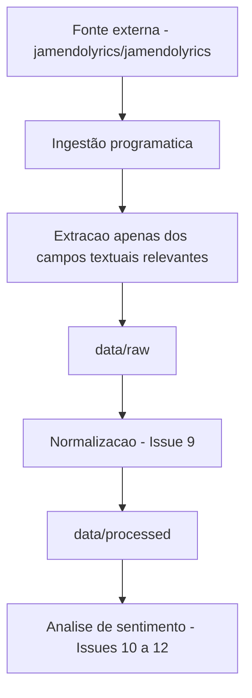
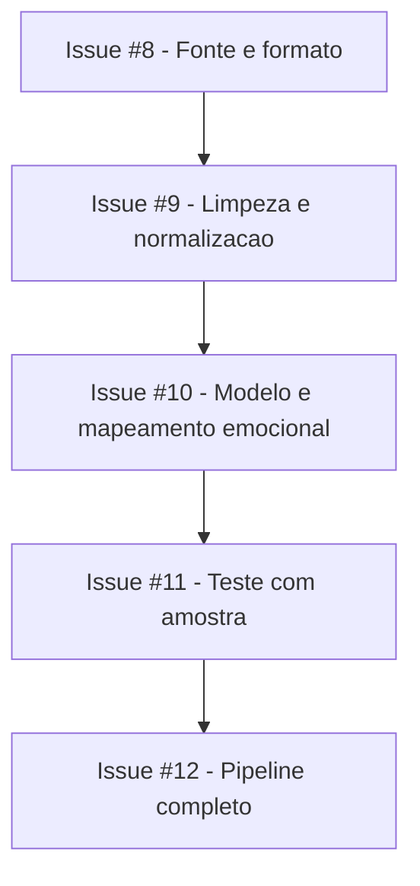

# Fonte e Formato do Dataset de Letras — Playcatch

**Data:** 17/08/2026
**Marco:** Milestone 1 — Análise de Sentimentos das Letras
**Autor:** Vagner Ferreira
**Projeto:** Playcatch
**Status:** Decisão inicial de fonte e formato

---

## 1. Objetivo

Antes de implementar qualquer etapa de limpeza, modelagem ou análise de sentimento, é necessário definir com clareza de onde vêm as letras que alimentarão o pipeline e qual será o formato desses dados dentro do projeto. Essa definição reduz retrabalho nas próximas issues da Milestone 1 (limpeza/normalização, carregamento do modelo, testes e execução do pipeline completo) e estabelece, desde já, um contrato de dados estável para os módulos de recomendação (M2) e chatbot (M3), que consumirão esses dados indiretamente através do dataset processado.

Este documento cobre exclusivamente o escopo da Issue #8: definição da fonte, do formato e da estrutura dos registros. Nenhuma implementação (ingestão, limpeza, modelo de sentimento) é realizada aqui.

## 2. Fonte de dados

**Fato confirmado** — verificado na página do dataset no Hugging Face em 17/08/2026:

- **Nome:** JamendoLyrics MultiLang dataset for lyrics research
- **Identificador Hugging Face:** `jamendolyrics/jamendolyrics`
- **Plataforma:** Hugging Face Datasets Hub
- **Origem das faixas:** músicas do Jamendo (plataforma de música sob licenças Creative Commons)
- **Finalidade original do dataset:** benchmark de **Automatic Lyrics Alignment (ALA)** — alinhamento automático entre áudio e letra, e não um corpus voltado a análise de sentimento ou NLP geral
- **Quantidade de registros:** 79 músicas, distribuídas por idioma: inglês (20), alemão (20), espanhol (20), francês (19)
- **Idiomas presentes:** inglês (`en`), francês (`fr`), alemão (`de`), espanhol (`es`)
- **Modalidades:** áudio (arquivos MP3) e texto
- **Campos disponíveis por registro:** `audio`, `name`, `url`, `artist`, `title`, `genre`, `license_type`, `language`, `lyric_overlap`, `polyphonic`, `non_lexical`, `text` (letra completa), `lines` (letra segmentada por linha, com timestamps), `words` (letra segmentada por palavra, com timestamps)
- **Método de carregamento:** biblioteca `datasets`, via `load_dataset("jamendolyrics/jamendolyrics", split="test")`, com subconjuntos por idioma disponíveis
- **Trabalho acadêmico associado:** dataset introduzido no artigo ICASSP 2023 "Contrastive Learning-Based Audio to Lyrics Alignment for Multiple Languages" (Durand, Stoller, Ewert)

**Observação de contexto (não integra a decisão desta Issue):** existe uma variante relacionada, `jamendolyrics/jam-alt`, voltada especificamente para transcrição de letras (ALT). Ela é mencionada apenas como referência; a fonte escolhida para o Playcatch permanece `jamendolyrics/jamendolyrics`.

O dataset deve ser tratado como **fonte de dados para pesquisa/desenvolvimento**, e não como conteúdo que o Playcatch está automaticamente autorizado a redistribuir — ver Seção 4.

## 3. Justificativa da escolha

**Decisão atual:**

- **Facilidade de ingestão:** carregamento direto via `datasets.load_dataset`, biblioteca já presente no ambiente do projeto.
- **Estrutura dos dados:** formato tabular, com campos de texto, artista, título e idioma prontos para uso.
- **Compatibilidade com o stack atual:** nativo do ecossistema Hugging Face, integrando-se com `transformers` e `huggingface_hub`, já utilizados no projeto.
- **Simplicidade de reprodução:** dataset público, versionado no Hugging Face Hub, com tamanho reduzido (79 músicas), adequado ao escopo de um checkpoint.
- **Multilinguismo:** cobre 4 idiomas, útil para validar o pipeline além de um único idioma.

**Limitações identificadas:**

- O dataset foi desenhado para alinhamento música-letra, não para análise de sentimento — não há rótulos de sentimento nativos; precisarão ser gerados integralmente pelo pipeline da M1.
- O volume é pequeno (79 músicas), suficiente para um projeto de portfólio/checkpoint, mas limitado para treinar (e não apenas aplicar) um modelo de sentimento.
- O dataset inclui áudio, volume desnecessário para o escopo textual do Playcatch — apenas campos textuais serão utilizados (ver Seção 5).
- O suporte a 4 idiomas implica que o modelo de sentimento precisará lidar com múltiplos idiomas, ou o escopo será restringido — **ponto pendente**, a ser tratado na Issue #10.

## 4. Licença e uso

**Ponto pendente de verificação antes da distribuição dos dados.**

**Fato confirmado:**

- Cada música possui seu próprio valor de `license_type` (campo por registro, não uma licença única cobrindo todo o dataset). Entre os valores observados na prévia dos dados estão variantes Creative Commons como `CC BY-NC-ND`, `CC BY-NC-SA` e `CC BY-SA`.
- As faixas se originam do Jamendo, plataforma que distribui músicas sob licenças Creative Commons definidas por cada artista.

O repositório do dataset possui licença MIT para seu código e documentação, mas os conteúdos textuais e de áudio das faixas não estão automaticamente cobertos por essa licença. O uso desses conteúdos deve ser analisado de acordo com o `license_type` associado a cada faixa.

A avaliação detalhada das permissões de uso e redistribuição das letras não faz parte da implementação desta Issue e deve ser verificada antes de qualquer publicação ou distribuição dos dados derivados.

Não se afirma, nesta documentação, que o projeto está ou não autorizado a redistribuir as letras — essa é uma análise jurídica que permanece pendente e não é conduzida aqui.

## 5. Estratégia de ingestão



- **Fonte externa:** dataset original no Hugging Face, não modificado.
- **Ingestão programática:** carregamento via `datasets.load_dataset`.
- **Extração apenas dos campos textuais relevantes:** somente `name`, `title`, `artist`, `language` e `text` serão extraídos; os arquivos de áudio e as anotações de timestamp (`lines`, `words`) não serão incorporados ao projeto.
- **`data/raw/`** e **`data/processed/`:** ver Seção 6.
- **Normalização (Issue #9)** e **Análise de sentimento (Issues #10 a #12):** fora do escopo desta Issue, mencionadas apenas para indicar o próximo passo do fluxo.

## 6. Organização dos dados

```text
data/
├── raw/
└── processed/
```

- **`data/raw/`**: conterá os dados textuais extraídos da fonte, preservando os campos de origem relevantes para o projeto e evitando a incorporação de áudio desnecessário ao escopo textual da M1. Não corresponde a uma cópia integral do dataset original (que inclui áudio e anotações de timestamp), apenas ao subconjunto textual extraído.
- **`data/processed/`**: conterá os dados já normalizados, estruturados segundo o contrato de registros definido na Seção 7, prontos para consumo pelas etapas seguintes da Milestone 1.

## 7. Contrato inicial dos registros

**Proposta** (a ser validada na implementação das próximas issues):

| Campo      | Tipo esperado | Obrigatório | Descrição |
| ---------- | ------------- | ----------- | --------- |
| `song_id`  | string        | sim         | Identificador interno da música |
| `title`    | string        | sim         | Título |
| `artist`   | string        | sim         | Artista |
| `language` | string        | não         | Idioma |
| `lyrics`   | string        | sim         | Texto da letra |

O campo `song_id` é proposto como derivado do campo `name` da fonte (que já funciona como um identificador único por faixa no dataset original). Essa é uma **proposta**; sua definição final e implementação efetiva serão validadas na Issue #9, e não devem ser consideradas já implementadas.

Os campos `title`, `artist`, `language` e `lyrics` correspondem, respectivamente, aos campos `title`, `artist`, `language` e `text` da fonte original — o nome `lyrics` é a nomenclatura interna adotada pelo Playcatch, e não o nome do campo na fonte.

## 8. Formato interno

**Decisão atual:**

```text
data/
├── raw/
└── processed/
```

Formato inicial: **CSV**

Justificativa:
- simples e legível;
- suficiente para o volume atual (79 registros);
- fácil de validar manualmente;
- compatível com o stack atual (`pandas`, `datasets`).

Esta escolha não é definitiva: caso o volume de dados cresça ou surjam necessidades de metadados mais complexos, o formato poderá ser revisado (ex.: JSON ou Parquet) em issue futura, sem impacto no contrato de campos da Seção 7.

## 9. Rastreabilidade

Os dados em `data/processed/` poderão ser relacionados à fonte original através do campo `song_id` (proposto como derivado do identificador `name` da fonte), permitindo retornar ao registro correspondente em `data/raw/` ou ao dataset original no Hugging Face para conferência.

Não há, nesta fase, mecanismo de versionamento de dados (ex.: DVC, hashes de integridade) implementado ou planejado. Caso isso se torne necessário, deverá ser tratado em issue própria.

## 10. Relação com as próximas Issues



Cada issue deve respeitar seu próprio escopo. Nesta Issue #8, não são implementados: ingestão de dados, download do dataset, limpeza, normalização, modelo de sentimento, categorias emocionais, dataset processado, score de sentimento ou qualquer componente de recomendação. Essas atividades pertencem integralmente às issues #9 a #12.

## 11. Decisão

- **Fonte escolhida:** `jamendolyrics/jamendolyrics`, no Hugging Face Datasets Hub (79 músicas, 4 idiomas: en, fr, de, es).
- **Estratégia de ingestão:** carregamento via `datasets.load_dataset`, extraindo apenas os campos textuais relevantes, sem incorporar áudio ao projeto.
- **Formato interno:** CSV, para `data/raw/` e `data/processed/` — não definitivo.
- **Estrutura de armazenamento:** `data/raw/` (subconjunto textual extraído da fonte) e `data/processed/` (dados normalizados, prontos para análise de sentimento).
- **Contrato dos registros (proposta):** `song_id`, `title`, `artist`, `language` (opcional), `lyrics`.

## 12. Pendências e critérios de revisão

- **Ponto pendente:** confirmação, faixa a faixa, de que os `license_type` (`CC BY-NC-ND`, `CC BY-NC-SA`, `CC BY-SA`, entre outros observados) permitem o uso pretendido pelo Playcatch, especialmente quanto à geração de dados derivados (rótulos de sentimento) e a eventual publicação/distribuição fora do ambiente de desenvolvimento.
- **Ponto pendente:** validação final do mapeamento de `song_id` a partir do campo `name` da fonte, a ser implementada na Issue #9.
- **Ponto pendente:** decisão sobre o escopo de idiomas suportados pelo pipeline de sentimento, a ser tratada na Issue #10.
- **Ponto pendente:** possível revisão do formato interno (CSV → JSON/Parquet), caso o volume ou a complexidade dos dados aumente.
- **Critério de revisão:** este documento deve ser revisitado caso a fonte de dados mude, caso novos campos sejam incorporados ao contrato, ou caso a avaliação de licenciamento da Seção 4 seja concluída com resultado que exija ajuste no uso ou na distribuição dos dados.