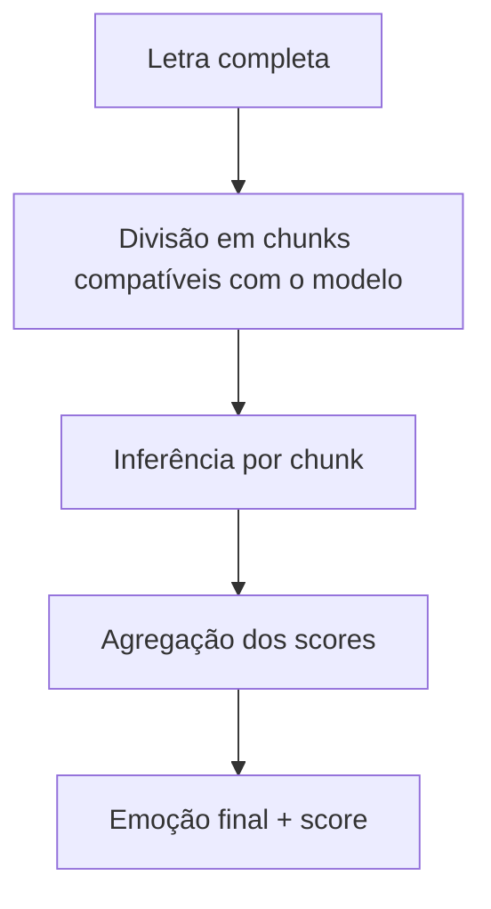
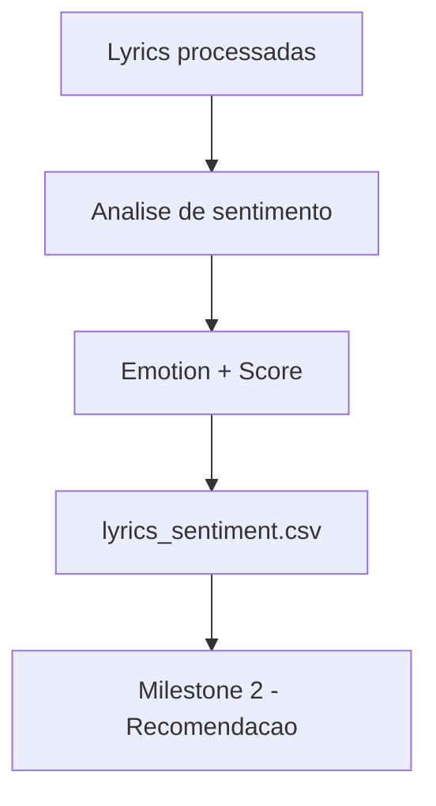

# Execução Completa do Pipeline de Sentimento — Playcatch

**Data:** 17/08/2026
**Marco:** Milestone 1 — Análise de Sentimentos das Letras
**Autor:** Vagner Ferreira
**Projeto:** Playcatch
**Status:** Pipeline completo executado e validado

---

## 1. Objetivo

Documentar a execução completa do pipeline de análise de sentimentos sobre o conjunto total de letras do Playcatch, registrando a integridade do dataset final, a distribuição das previsões produzidas pelo modelo, as decisões técnicas adotadas durante a execução (como a estratégia de agregação para letras longas) e as limitações da análise. Este documento encerra tecnicamente a Milestone 1, sem antecipar decisões de recomendação, que pertencem à Milestone 2.

## 2. Contexto

A Milestone 1 — Análise de Sentimentos das Letras — foi construída pelas seguintes Issues:

```text
#8  — Fonte/formato do dataset ✅
#9  — Limpeza/normalização ✅
#10 — Modelo de sentimento + mapeamento ✅
#11 — Validação com amostra pequena ✅
#12 — Pipeline completo e resultados 🔄
```

A Issue #11 validou uma amostra de 8 letras (duas por idioma), confirmou o funcionamento técnico do pipeline nos quatro idiomas do dataset, identificou e corrigiu uma inconsistência na normalização dos códigos de idioma, e aprovou o pipeline para processamento completo com ressalvas — sem validação de acurácia no domínio musical. A Issue #12 é o último checkpoint da Milestone 1.

## 3. Dataset de entrada

A Issue #9 produziu o dataset processado `data/processed/lyrics_clean.csv`, com as seguintes características:

- 79 registros;
- 5 colunas: `song_id`, `title`, `artist`, `language`, `lyrics`;
- idiomas normalizados para os códigos `en`, `de`, `es`, `fr`;
- zero valores nulos;
- zero letras vazias.

A Issue #10 definiu o modelo `MilaNLProc/xlm-emo-t`, com as categorias emocionais `anger`, `fear`, `joy`, `sadness` e contrato de saída `emotion` + `score`. A configuração do modelo foi validada diretamente como:

```text
{
    0: "anger",
    1: "fear",
    2: "joy",
    3: "sadness"
}
```

## 4. Execução completa

A execução foi realizada sobre o dataset completo:

```text
Entrada: 79 registros
Saída: 79 registros
```

O pipeline foi concluído com sucesso:

```text
Pipeline concluído com sucesso.
```

O arquivo final gerado foi:

```text
data/processed/lyrics_sentiment.csv
```

## 5. Estrutura do arquivo final

O CSV final possui as seguintes colunas:

```text
song_id
title
artist
language
lyrics
emotion
score
```

Dimensão confirmada: **79 linhas, 7 colunas**.

Os cinco campos originais (`song_id`, `title`, `artist`, `language`, `lyrics`) foram preservados sem alteração. Os campos `emotion` e `score` são os resultados adicionados pelo pipeline de análise de sentimento da Milestone 1.

## 6. Integridade dos resultados

Resultados reais da validação de integridade:

```text
Shape: (79, 7)

Nulos:
song_id   → 0
title     → 0
artist    → 0
language  → 0
lyrics    → 0
emotion   → 0
score     → 0

Scores fora de [0, 1] → 0
```

Portanto:

- 79/79 registros processados (100% de cobertura);
- zero valores nulos em qualquer coluna;
- zero letras vazias;
- zero scores fora do intervalo `[0, 1]`;
- todas as previsões possuem `emotion` e `score` preenchidos.

## 7. Distribuição das emoções

Resultados reais observados no dataset completo:

| Emoção    | Registros |
| --------- | --------: |
| `sadness` |        32 |
| `joy`     |        26 |
| `anger`   |        19 |
| `fear`    |         2 |
| **Total** |    **79** |

Esta tabela representa a **distribuição das previsões produzidas pelo modelo** sobre o conjunto de letras processado, e não deve ser interpretada como a verdade emocional objetiva das músicas. Não se afirma que o dataset é majoritariamente triste ou alegre como característica real das faixas — apenas que essas foram as classificações produzidas pelo pipeline nesta execução.

## 8. Distribuição dos scores

Resultados reais:

```text
Score mínimo: 0.3506213873624801
Score máximo: 0.979413628578186
```

- `score` é a pontuação atribuída pelo modelo à classe emocional prevista para cada registro;
- o intervalo observado está integralmente dentro de `[0, 1]`;
- valores mais baixos representam menor `score` atribuído pelo modelo à classe prevista;
- `score` não deve ser interpretado automaticamente como uma probabilidade calibrada nem como uma medida de acurácia;
- não foi definido, nesta Issue, nenhum threshold para rejeição ou classificação como "incerta".

A documentação mantém explícita a distinção entre:

```text
score do modelo
≠
acurácia
≠
ground truth
```

## 9. Estratégia para letras longas

O modelo `MilaNLProc/xlm-emo-t` foi desenvolvido para classificação de emoções em texto de mídia social, com uma janela de contexto limitada. Durante a execução completa, ocorreu inicialmente um erro relacionado a sequências de texto mais longas do que o suportado pelo modelo.

Esse problema foi resolvido através de uma estratégia de **chunking**: as letras que excedem a janela de processamento são divididas em chunks de até 480 tokens, utilizando sobreposição de 64 tokens entre blocos:

```text
MAX_TOKENS = 480
OVERLAP_TOKENS = 64
```

Cada chunk é processado individualmente pelo modelo, os scores por emoção são agregados entre os chunks, e a emoção final atribuída ao registro é a categoria com maior score agregado.



Esta é a **estratégia técnica atual** adotada para contornar o limite de contexto do modelo, com os parâmetros de 480 tokens por chunk e 64 tokens de sobreposição definidos para esta implementação — não são apresentados como parâmetros universais, nem esta abordagem é apresentada como a melhor estratégia possível. Poderá ser revisada em iterações futuras do projeto.

## 10. Observações de execução

O Playcatch possui ambiente CUDA funcional, com GPU NVIDIA GeForce RTX 4060 e CUDA disponível. A execução completa foi realizada utilizando o ambiente configurado para GPU.

Durante a execução, o `transformers` apresentou um aviso relacionado ao uso sequencial do pipeline em GPU. Este foi apenas um **aviso de eficiência/otimização**, não uma falha — não houve erro, o pipeline concluiu normalmente e não houve impacto na integridade dos resultados desta Issue. A otimização de batching poderá ser considerada no futuro, caso o volume de dados aumente; este ponto não representa um bloqueio para a conclusão da Milestone 1.

## 11. Limitações

O modelo `MilaNLProc/xlm-emo-t` foi desenvolvido para texto de mídia social, não especificamente para letras musicais, e não foi validado cientificamente para esse domínio. Portanto:

> A execução completa confirma o funcionamento técnico do pipeline e a geração dos resultados para os 79 registros, mas não demonstra que as previsões são semanticamente corretas para todas as letras.

Não existe ground truth humano nesta análise. Não foram calculadas métricas de accuracy, F1, precision ou recall. A execução confirma o funcionamento técnico do pipeline, não a correção semântica das previsões — os resultados do modelo não são transformados em conclusões subjetivas sobre as músicas nesta documentação.

## 12. Versionamento e licenciamento

O arquivo `data/processed/lyrics_sentiment.csv` é gerado localmente e contém letras de músicas e os resultados de sentimento derivados delas. Conforme já registrado na Issue #8, os dados textuais possuem licenças associadas a cada faixa, e sua redistribuição deve ser analisada antes de qualquer publicação.

Registra-se explicitamente que:

- o arquivo é o artefato final da Milestone 1, gerado localmente;
- os CSVs contendo letras permanecem fora do versionamento Git, por precaução de licenciamento;
- o código que reproduz o pipeline (ingestão, limpeza, modelo, agregação) permanece versionado normalmente;
- a redistribuição do dataset textual permanece dependente da análise de licenciamento por faixa, já registrada na Issue #8, e não é resolvida nesta Issue.

Não se afirma que o CSV pode ser publicado no GitHub, nem que ele está juridicamente impedido de ser publicado — essa avaliação permanece pendente.

## 13. Relação com a Milestone 2



O dataset final (`lyrics_sentiment.csv`) servirá como entrada para o módulo de recomendação da Milestone 2, que consumirá as colunas `emotion` e `score` geradas por este pipeline. A lógica do recomendador — critérios de filtragem, uso do score, mecanismo de feedback — ainda não foi definida e será tratada integralmente na Milestone 2, não sendo antecipada neste documento.

## 14. Critérios de conclusão

| Critério                          | Resultado        |
| ---------------------------------- | ------------------ |
| Pipeline completo executado        | ✅                 |
| 79 letras processadas              | ✅                 |
| Emotion gerado para cada registro  | ✅                 |
| Score gerado para cada registro    | ✅                 |
| Zero nulos                         | ✅                 |
| Zero scores inválidos              | ✅                 |
| CSV final criado                   | ✅                 |
| Integridade estrutural validada    | ✅                 |
| Pronto para consumo pela M2        | ✅                 |
| Validação semântica humana         | ❌ Não realizada   |

## 15. Decisão final

**Milestone 1 tecnicamente concluída.**

```text
Issue #8
Fonte/formato
↓
Issue #9
Limpeza/normalização
↓
Issue #10
Modelo/mapeamento
↓
Issue #11
Validação amostral
↓
Issue #12
Pipeline completo
```

A Milestone 1 é **tecnicamente concluída**: fonte definida, limpeza implementada, modelo definido, amostra validada, pipeline completo executado e dataset final produzido, com integridade estrutural verificada. Isso não constitui, no entanto, uma validação científica ou estatística da qualidade das previsões do modelo no domínio musical.

## 16. Pendências futuras

As seguintes melhorias são registradas como trabalho futuro, fora do escopo da Milestone 1:

- avaliação humana das previsões de sentimento;
- definição de thresholds de confiança para previsões de baixo score;
- análise comparativa de distribuição de emoções por idioma;
- avaliação mais aprofundada dos scores do modelo;
- otimização de batching do pipeline em GPU;
- avaliação de modelos alternativos, especificamente treinados ou validados em domínio musical;
- eventual revisão do método de agregação de chunks para letras longas;
- governança e análise final de licenciamento dos dados textuais antes de qualquer publicação.

Nenhuma dessas pendências é tratada como requisito da Milestone 1.

## Checklist da Issue #12

- [x] Pipeline completo executado
- [x] 79 letras processadas
- [x] Emoção gerada para cada registro
- [x] Score registrado para cada registro
- [x] Dataset final criado
- [x] Integridade estrutural validada
- [x] Scores validados
- [x] Distribuição das emoções registrada
- [x] Limitações documentadas
- [x] Artefato pronto para consumo da Milestone 2