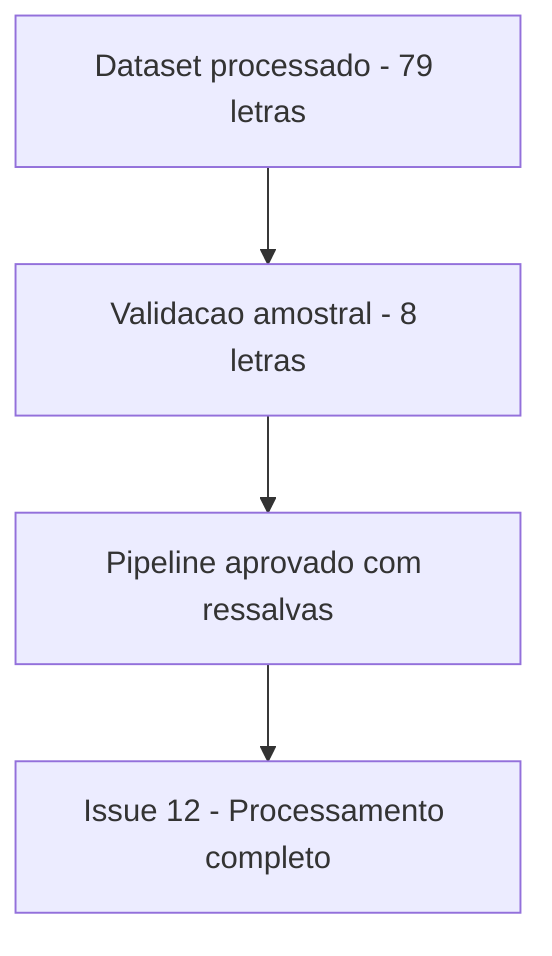

# Validação do Pipeline de Sentimento — Playcatch

**Data:** 17/08/2026
**Marco:** Milestone 1 — Análise de Sentimentos das Letras
**Autor:** Vagner Ferreira
**Projeto:** Playcatch
**Status:** Validação experimental da amostra

---

## 1. Objetivo

Validar o comportamento real do pipeline de análise de sentimento — definido na Issue #10 — sobre uma pequena amostra de letras do Playcatch, antes de executá-lo sobre o conjunto completo de 79 registros (Issue #12). O objetivo desta Issue é técnico: confirmar que o pipeline executa corretamente nos quatro idiomas presentes no dataset, que produz labels e scores válidos, e identificar eventuais inconsistências a corrigir antes da execução completa — não medir acurácia ou desempenho do modelo no domínio musical.

## 2. Contexto

A Issue #9 produziu o dataset processado `data/processed/lyrics_clean.csv`, com 79 registros, 5 colunas (`song_id`, `title`, `artist`, `language`, `lyrics`), zero valores nulos e zero letras vazias, com idiomas normalizados para os códigos `en`, `de`, `es`, `fr`.

A Issue #10 definiu e implementou o modelo `MilaNLProc/xlm-emo-t`, carregado via:

```python
pipeline(
    "text-classification",
    model="MilaNLProc/xlm-emo-t",
)
```

Categorias emocionais definidas: `anger`, `fear`, `joy`, `sadness`. Contrato de saída: `emotion` + `score`.

Nesta Issue, o `id2label` do modelo foi validado diretamente durante a execução:

```text
{
    0: "anger",
    1: "fear",
    2: "joy",
    3: "sadness"
}
```

## 3. Metodologia da amostra

A amostra foi selecionada de forma determinística: **duas letras por idioma**, a partir do dataset processado da Issue #9.

| Idioma    | Amostras |
| --------- | -------: |
| `en`      |        2 |
| `de`      |        2 |
| `es`      |        2 |
| `fr`      |        2 |
| **Total** |    **8** |

O objetivo foi garantir uma verificação mínima de todos os quatro idiomas antes da execução completa. Esta amostra **não é estatisticamente representativa** do dataset de 79 letras — trata-se de uma verificação técnica pontual, não de uma avaliação estatística.

## 4. Resultados

Resultados reais observados na execução do pipeline sobre a amostra:

| Idioma | Música                 | Emoção    |  Score |
| ------ | ---------------------- | --------- | -----: |
| `en`   | Give Me The Same       | `sadness` | 0.9589 |
| `en`   | Keep On                | `joy`     | 0.5408 |
| `de`   | 1 Freak                | `joy`     | 0.4274 |
| `es`   | Baila                  | `joy`     | 0.9710 |
| `es`   | Besando Sapos          | `joy`     | 0.9141 |
| `de`   | Bitte beweg dich nicht | `anger`   | 0.9689 |
| `fr`   | Capotes à un Franc     | `sadness` | 0.5455 |
| `fr`   | CHRISTMAS AVEC TOI     | `joy`     | 0.9143 |

Esses valores são resultados reais desta execução e são apresentados sem alteração.

## 5. Observações experimentais

### 5.1 Cobertura multilíngue

O pipeline executou com sucesso nos quatro idiomas (`en`, `de`, `es`, `fr`) presentes na amostra. Não houve erro de inferência relacionado ao idioma nesta execução.

### 5.2 Categorias

Todas as previsões observadas pertencem ao conjunto de categorias definido na Issue #10 (`anger`, `fear`, `joy`, `sadness`). Nenhum label inesperado foi produzido.

### 5.3 Scores baixos

Três resultados apresentaram scores relativamente baixos:

```text
[de] 1 Freak → joy → 0.4274
[en] Keep On → joy → 0.5408
[fr] Capotes à un Franc → sadness → 0.5455
```

Esses casos são registrados como **casos de menor confiança**, não como previsões necessariamente incorretas. Não há, nesta Issue, base para concluir que houve erro do modelo apenas a partir do score.

### 5.4 Concentração em `joy`

A amostra apresentou várias previsões classificadas como `joy`. Este é um **resultado observado**, não uma conclusão sobre o comportamento geral do modelo, pelos seguintes motivos:

- a amostra possui apenas 8 letras;
- não existe anotação humana de ground truth para comparação;
- a seleção não constitui amostra estatisticamente representativa do dataset completo;
- portanto, a distribuição observada não permite concluir sobre viés do modelo ou desempenho global — trata-se de um **ponto para avaliação futura**, caso a concentração se repita na execução completa (Issue #12).

## 6. Inconsistências identificadas e correções

### Inconsistência de idioma

A Issue #9 inicialmente utilizava os nomes completos dos idiomas fornecidos pela fonte (`English`, `French`, `German`, `Spanish`). Foi realizada uma normalização para os códigos `en`, `fr`, `de`, `es`, e o pipeline foi reexecutado após essa correção.

Na validação final da amostra, a distribuição observada por idioma foi:

```text
{'de': 2, 'en': 2, 'es': 2, 'fr': 2}
```

Esta inconsistência é considerada **resolvida**.

### Scores baixos

Registrados como observação para acompanhamento (ver Seção 5.3), não como falha do pipeline.

### Ausência de ground truth

Não existe, nesta Issue, classificação humana de referência para as letras avaliadas. Portanto:

> A validação realizada confirma o funcionamento técnico do pipeline, mas não mede acurácia ou F1 sobre letras musicais.

## 7. Critérios de validação

| Critério                         | Resultado        |
| --------------------------------- | ----------------- |
| Pipeline executa                  | ✅                |
| Quatro idiomas processados        | ✅                |
| Labels válidos                    | ✅                |
| Score disponível                  | ✅                |
| Nenhum erro de inferência         | ✅                |
| Dataset preparado corretamente    | ✅                |
| Ground truth humano               | ❌ Não disponível |
| Validação de acurácia do domínio  | ❌ Fora do escopo |

Resultados de qualidade do projeto confirmados no momento da validação:

```text
Ruff → All checks passed!
Ruff format → 19 files already formatted
Pytest → 7 passed
```

Esses resultados validam a implementação técnica (código, formatação, testes automatizados) e não devem ser confundidos com métricas de qualidade ou desempenho do modelo de sentimento.

## 8. Limitações

- Não há, nesta Issue, evidência de que o modelo é preciso ou impreciso para letras de música — apenas que executa tecnicamente e produz saídas no formato esperado.
- Não é possível afirmar que o modelo apresenta desempenho equivalente entre os quatro idiomas, já que a amostra é pequena (2 letras por idioma) e não há ground truth.
- Os scores baixos observados (0.4274, 0.5408, 0.5455) são indicadores de menor confiança do modelo naquelas previsões específicas, não evidência de erro.
- A concentração de resultados em `joy` é um resultado observado nesta amostra específica, não uma conclusão sobre viés do modelo ou sobre a distribuição real de sentimentos no dataset completo.
- Não se afirma, nesta documentação, que o modelo é adequado definitivamente para o domínio musical — essa é uma hipótese ainda em aberto, a ser reavaliada com o volume completo de dados na Issue #12 e em etapas futuras.

## 9. Decisão sobre o pipeline

**Decisão:** Aprovado para processamento completo, com ressalvas.

O pipeline está tecnicamente funcional e atende ao objetivo da Issue #11: executar corretamente nos quatro idiomas do dataset, produzir labels válidos dentro do conjunto de categorias definido, e disponibilizar o score de confiança de cada previsão.

Ressalvas registradas:

- ainda não há validação de acurácia no domínio musical;
- os scores baixos observados serão mantidos para análise futura, sem exclusão ou reprocessamento nesta Issue;
- não será definido threshold de confiança nesta Issue;
- não será feita troca de modelo nesta Issue;
- a execução completa da Milestone 1 (Issue #12) poderá prosseguir com o pipeline validado;
- eventuais limitações observadas nesta amostra serão registradas para avaliação posterior, quando o volume completo de dados estiver disponível.

## 10. Relação com a Issue #12



A Issue #12 deverá: processar o conjunto completo de 79 letras; preservar os campos `emotion` e `score` para cada registro; produzir o dataset final de sentimentos; registrar eventuais erros de inferência que ocorram na execução completa; e permitir análise agregada das previsões (por exemplo, distribuição de categorias e de scores no conjunto completo) — análise essa que não é conduzida nesta Issue #11, restrita à amostra de 8 letras.

## Checklist da Issue #11

- [x] Pequena amostra selecionada
- [x] Limpeza e normalização executadas
- [x] Modelo aplicado às letras
- [x] Categorias verificadas
- [x] Scores verificados
- [x] Inconsistência de idioma identificada e corrigida
- [x] Limitações registradas
- [x] Pipeline aprovado para processamento completo