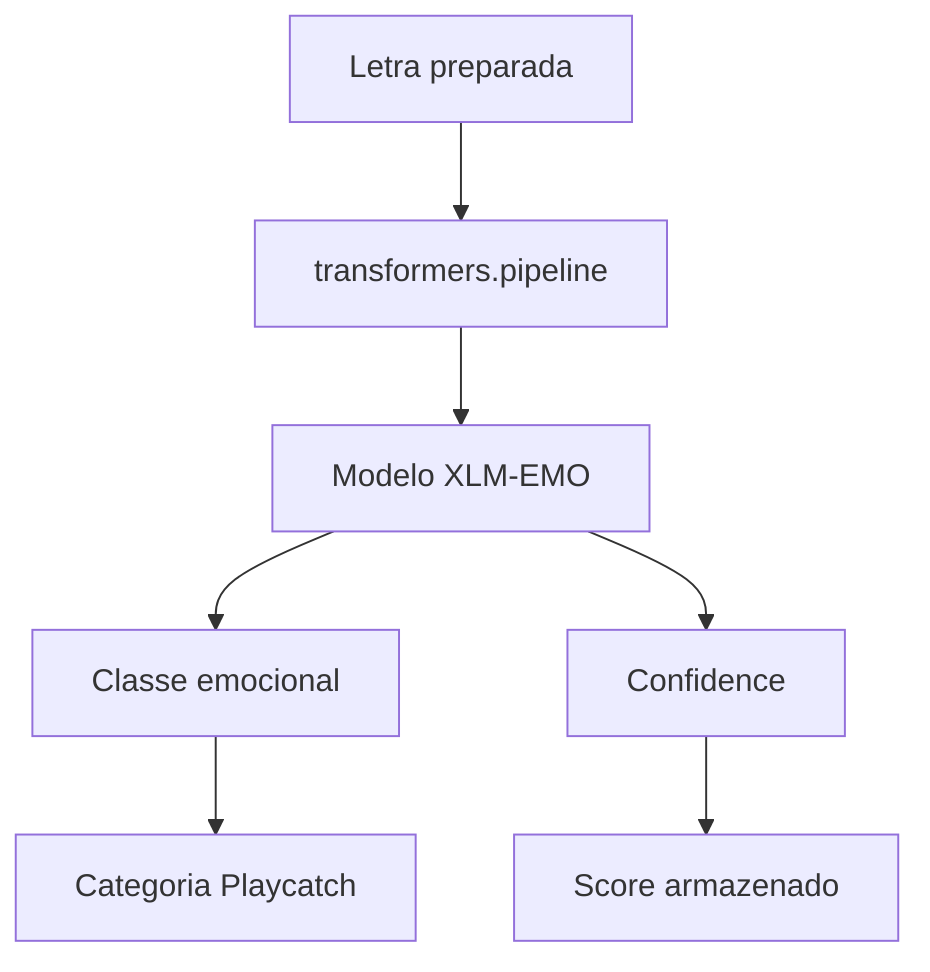

# Modelo de Sentimento e Mapeamento Emocional — Playcatch

**Data:** 17/08/2026
**Marco:** Milestone 1 — Análise de Sentimentos das Letras
**Autor:** Vagner Ferreira
**Projeto:** Playcatch
**Status:** Decisão técnica inicial

---

## 1. Objetivo

Definir, para a Milestone 1, qual modelo de sentimento será utilizado para analisar as letras processadas na Issue #9, qual o formato de suas previsões, e como essas previsões serão traduzidas para as categorias emocionais internas do Playcatch. Esta definição prepara a camada de análise de sentimento para ser validada empiricamente na Issue #11, sem antecipar essa validação.

## 2. Modelo selecionado

**Decisão atual:** `MilaNLProc/xlm-emo-t`, disponível no Hugging Face Hub.

**Fato confirmado** (verificado no model card oficial em 17/08/2026):

- Arquitetura base: XLM-RoBERTa (`xlm-roberta`), tarefa de `text-classification`.
- É a versão fine-tuned do modelo XLM-T ("This model is the fine-tuned version of the XLM-T model").
- Publicado no artigo *"XLM-EMO: Multilingual Emotion Prediction in Social Media Text"* (Bianchi, Nozza & Hovy, WASSA Workshop, ACL 2022).
- Objetivo declarado do modelo: predição multilíngue de emoções em texto de **mídias sociais**, treinado a partir de datasets de emoção coletados em 19 idiomas.
- Desempenho declarado no model card: F1 de 0,85 no conjunto de teste do próprio trabalho de origem.
- Usuários pretendidos, segundo o model card: pesquisadores de IA; o modelo é descrito como "research output for research communities".
- Licença: **MIT**.
- Arquivo de pesos (`pytorch_model.bin`) com aproximadamente 1,11 GB.
- O próprio model card alerta que restrições podem se aplicar aos dados de origem (derivados de datasets existentes) ou ao Twitter, citado como principal fonte de dados de treinamento.

## 3. Justificativa da escolha

**Decisão atual:**

- Cobertura multilíngue nativa, compatível com os 4 idiomas presentes no dataset processado do Playcatch (`en`, `de`, `es`, `fr`), já que o modelo foi treinado sobre dados coletados em 19 idiomas.
- Integração direta com a API `transformers.pipeline`, já utilizada no stack do projeto.
- Licença MIT, sem restrições adicionais quanto ao uso do modelo em si (distinta da licença dos dados de treinamento — ver Seção 9 sobre licenciamento).
- Escopo do checkpoint favorece o uso de um modelo pré-treinado pronto, sem necessidade de fine-tuning próprio nesta fase.

**Limitação já reconhecida nesta escolha:** o modelo foi treinado para textos de mídia social (principalmente Twitter), e não para letras de música — essa diferença de domínio é tratada em detalhe na Seção 9.

## 4. Formato das previsões

**Fato confirmado:** o modelo é exposto como uma tarefa de `text-classification` do `transformers`, e o repositório de referência do projeto original (`MilaNLProc/xlm-emo`) demonstra que uma chamada de classificação retorna a emoção prevista para o texto de entrada — por exemplo, um texto com conteúdo raivoso é classificado como `anger`, e um texto de conteúdo alegre como `joy`.

Ao ser carregado via `transformers.pipeline` para `text-classification`, o formato de saída esperado é uma classificação com a **classe prevista** e a **pontuação (score/confiança)** associada a essa classe, conforme o comportamento padrão desse tipo de pipeline na biblioteca `transformers`.

## 5. Categorias emocionais do Playcatch

**Decisão atual:** o Playcatch manterá diretamente as categorias emitidas pelo modelo, sem criar categorias artificiais adicionais:

```text
anger
fear
joy
sadness
```

Não serão adotadas categorias como `positive`, `negative` ou `neutral`, nem emoções adicionais nesta etapa. A justificativa é manter o contrato emocional simples para o módulo de recomendação da Milestone 2.

**Observação sobre verificação:** a existência das classes `anger` e `joy` foi confirmada diretamente em um exemplo de uso do repositório oficial do projeto (`MilaNLProc/xlm-emo`). As classes `fear` e `sadness` são apresentadas nesta documentação com base na informação repassada para esta Issue e são consistentes com o escopo do artigo de origem do modelo (predição multilíngue de emoções), mas não foram confirmadas, nesta revisão, diretamente em uma listagem oficial e explícita das 4 classes no model card. A confirmação completa do conjunto de rótulos (`id2label`) deve ser verificada no momento da implementação (Issue #11), a partir da configuração real do modelo carregado.

## 6. Mapeamento modelo → Playcatch

**Decisão atual:**

| Saída do modelo | Categoria Playcatch |
| --------------- | -------------------- |
| `anger`          | `anger`               |
| `fear`           | `fear`                |
| `joy`            | `joy`                 |
| `sadness`        | `sadness`             |

O mapeamento é direto (identidade), sem transformação ou agrupamento de classes nesta fase.

## 7. Confiança da previsão

**Decisão atual:** a pontuação retornada pelo modelo será preservada junto à classe prevista, seguindo o contrato:

```text
emotion
confidence
```

Exemplo conceitual (ilustrativo, não um resultado real observado):

```text
emotion = "joy"
confidence = 0.91
```

- `emotion` representa a classe com maior probabilidade retornada pelo modelo.
- `confidence` representa a pontuação associada a essa previsão.
- A confiança será preservada no dataset de sentimentos para permitir análise posterior (ex.: identificar previsões pouco confiáveis).
- **Pendência:** critérios de threshold para baixa confiança não são definidos nesta Issue. Essa definição poderá ser revisada na Issue #11, após testes reais com letras do Playcatch.

## 8. Integração com `transformers.pipeline`

**Decisão atual:** o modelo será carregado através da API `pipeline` da biblioteca `transformers`, configurada para a tarefa `text-classification` com o modelo `MilaNLProc/xlm-emo-t`.

O fluxo conceitual previsto é:

1. o modelo é carregado através da API `pipeline`;
2. a entrada é o texto da letra já preparado pela etapa de limpeza/normalização (Issue #9);
3. a saída é uma classificação emocional dentre as 4 categorias definidas na Seção 5;
4. a pontuação/confiança da previsão é preservada junto ao resultado.

Detalhes de implementação de código (parâmetros exatos, tratamento de exceções, batching) não fazem parte do escopo desta documentação e pertencem à implementação técnica desta e das próximas issues.



## 9. Limitações

**Limitação confirmada e registrada:** o modelo `MilaNLProc/xlm-emo-t` foi treinado para classificação de emoções em **texto de mídias sociais** (principalmente dados derivados do Twitter, segundo o próprio model card), e não foi desenvolvido especificamente para **letras de música**. Letras possuem características textuais distintas de posts de mídia social (estrutura poética, repetição, metáfora, formato de verso/refrão), o que pode afetar o desempenho do modelo nesse domínio.

É necessário diferenciar claramente:

- **Adequação técnica inicial:** o modelo é multilíngue, acessível via `transformers`, com licença permissiva (MIT) e desempenho documentado (F1 de 0,85) no domínio original de treinamento (mídia social).
- **Validação específica no domínio de letras:** ainda **não realizada**. Não há, nesta Issue, qualquer afirmação de que o modelo já foi validado sobre letras de música ou sobre os dados do Playcatch.

A validação real sobre as letras do Playcatch será conduzida na **Issue #11 — Testar pipeline de sentimento com amostra pequena**.

## 10. Cobertura multilíngue

O Playcatch possui atualmente quatro idiomas na fonte de letras (Issue #8): `en`, `de`, `es`, `fr`. O modelo foi escolhido por oferecer cobertura multilíngue compatível com essa necessidade, tendo sido treinado com dados coletados em 19 idiomas segundo o artigo de origem.

**Importante:** a cobertura linguística declarada do modelo não deve ser confundida com desempenho comprovado no dataset do Playcatch. O desempenho real em cada um dos 4 idiomas presentes nas letras do projeto será observado empiricamente na Issue #11, e não é assumido ou estimado nesta documentação.

## 11. Relação com as próximas Issues

```text
Letra
  ↓
Sentimento
  ↓
Categoria emocional
  ↓
Dataset de sentimentos
  ↓
Recommendation
```

As categorias emocionais definidas nesta Issue serão utilizadas posteriormente pelo módulo de recomendação (Milestone 2), consumindo o dataset de sentimentos gerado ao final da Milestone 1 (Issue #12). A Issue #10 **não implementa** recomendação, algoritmo de sugestão, chatbot, thresholds definitivos, categorias adicionais, classificação multilabel, fine-tuning ou treinamento próprio de modelo — esses temas pertencem a outras etapas do roadmap e não são antecipados aqui.

## 12. Decisão técnica

- **Modelo escolhido:** `MilaNLProc/xlm-emo-t` (Hugging Face Hub), licença MIT, arquitetura XLM-RoBERTa fine-tuned a partir do XLM-T.
- **Forma de carregamento:** `transformers.pipeline` para a tarefa `text-classification`.
- **Categorias emocionais do Playcatch:** `anger`, `fear`, `joy`, `sadness`, mantidas diretamente da saída do modelo (mapeamento identidade).
- **Contrato de saída:** `emotion` (classe prevista) + `confidence` (pontuação associada), sem threshold definido nesta fase.
- **Domínio de origem do modelo:** mídia social/Twitter — divergente do domínio de aplicação do Playcatch (letras de música), o que constitui uma limitação registrada e não resolvida nesta Issue.

## 13. Pendências e critérios de revisão

- **Pendência:** validação empírica do desempenho do modelo sobre letras reais do Playcatch (Issue #11).
- **Pendência:** confirmação completa e oficial do conjunto de rótulos (`id2label`) do modelo no momento da implementação, já que apenas `anger` e `joy` foram confirmados diretamente em exemplo oficial nesta revisão.
- **Pendência:** definição de thresholds de confiança para previsões pouco confiáveis, a ser avaliada após os testes da Issue #11.
- **Pendência:** avaliação comparativa de desempenho entre os 4 idiomas (`en`, `de`, `es`, `fr`) presentes no dataset do Playcatch, também prevista para a Issue #11.
- **Critério de revisão:** este documento deve ser revisitado caso o modelo seja trocado, caso o conjunto de categorias emocionais seja alterado, ou caso a Issue #11 revele desempenho insuficiente que exija reconsiderar a escolha do modelo.

## Checklist da Issue #10

- [ ] Modelo selecionado
- [ ] Modelo carregado via `transformers.pipeline`
- [ ] Formato das previsões documentado
- [ ] Categorias emocionais definidas
- [ ] Mapeamento modelo → Playcatch definido
- [ ] Confidence documentado
- [ ] Limitações registradas
- [ ] Decisão técnica documentada